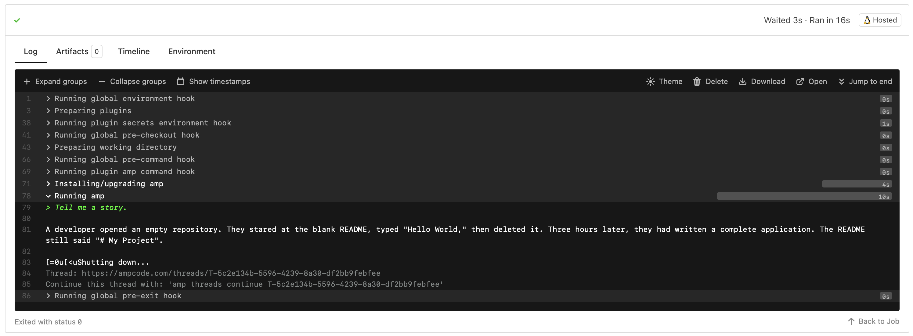

# Amp Example

[](https://buildkite.com/sj26/amp-example)

Run [Amp](https://ampcode.com) in a Buildkite pipeline.

Uses [amp-buildkite-plugin](https://github.com/sj26/amp-buildkite-plugin), a light wrapper for prompting amp.

```yaml
steps:
  - plugins:
      sj26/amp:
        prompt: |
          Tell me a story.
```

<a href="https://buildkite.com/sj26/amp-example/builds/latest?branch=main"></a>
